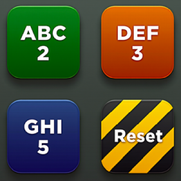
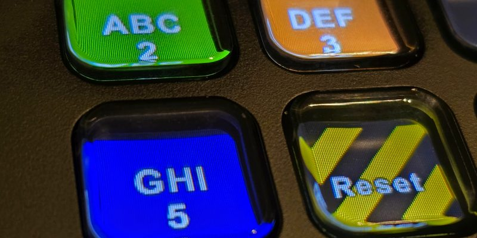
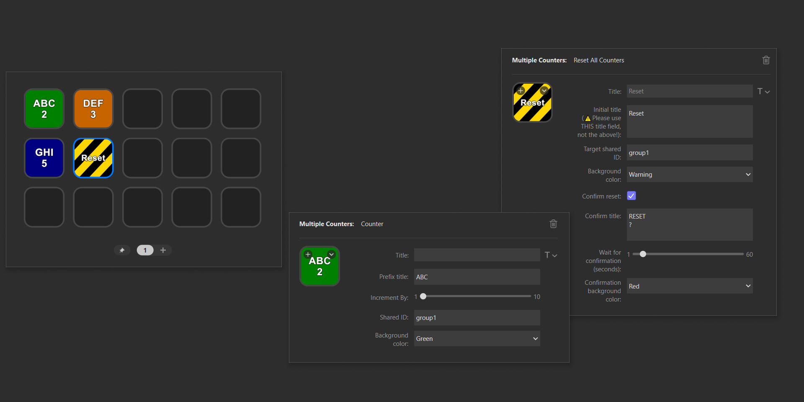

# Multiple Counters for Stream Deck

A Stream Deck plugin that lets you group multiple counters and reset them all with a single press. Perfect for stream sessions, production tracking, quality control counts, or any situation where you need to monitor and reset multiple counts together.
 
 

## ✨Features

- Create multiple counter keys
- Increment counters individually or synchronised as a group
- Two ways to reset: either hold the counter key or use a dedicated Reset Action key
- Reset multiple counters at once
- Optional confirmation before reset
- Customize background colors
- Works seamlessly inside Multi Actions
- Display-only counters for use as passive displays (e.g. updated via Multi Actions)

## 🚀Installation
1. Find the _Multiple Counters_ plugin in the Stream Deck Store or download [here](https://github.com/ElianKars/StreamDeck-Multiple-Counters/releases/tag/Latest).
2. Double-click the downloaded file to install
3. Stream Deck will automatically add the plugin

## 🔧 Usage

### Counter Action
1. Drag the Counter Action to your Stream Deck
2. Configure settings:
   - **`Title`**: Leave this field blank; it is only read for styling (font, size, alignment), not for the counter label.
   - **`Prefix Title`:** Set your label shown before the value.
   - **`Increment By`:** Choose value between `1-10`.
   - **`Sync group ID`:** Set an ID to group counters for synchronised increment. Example: `sync1`
   - **`Reset group ID`:** Set an ID to group counters for reset. Must match with 'Reset group ID' in a Reset Action. Example: `reset1`
   - **`Hold → reset key (ms)`:** Milliseconds to press and hold the key, to reset this counter to 0. Useful if you prefer not to use a separate Reset Action.
   - **`Hold → reset group (ms)`:** Milliseconds to press and hold the key, to reset all counters that share the same Reset group ID to 0. Useful if you prefer not to use a separate Reset Action.
   - **`Display-only`:** Key shows the live value but ignores presses. Counter can still be updated in a sync group.
   - **`Background Color`:** Choose a color.

> [!IMPORTANT]  
> Enter your label in `Prefix Title`. Use the built-in `Title` box only to style the text (font, size, alignment).

### Reset Action
1. Drag the Reset Action to your Stream Deck
2. Configure settings:
   - **`Title`**: Leave this field blank; it is only read for styling (font, size, alignment), not for the counter label.
   - **`Normal-state title`:** Set the initial title for the Reset Action.
   - **`Reset group ID`:** Match with counters you want to reset to 0. Example: `reset1`
   - **`Background Color`:** Choose normal state color.
   - **`Confirm Reset`:** Enable/disable double-press confirmation.
   - **`Confirm title`:** Set the title shown during the confirmation wait.
   - **`Second press timeout (ms)`:** Set confirmation timeout in milliseconds.
   - **`Confirmation background color`:** Choose color for confirmation state.

Each backgroundcolor also has an adjusted version '_(c)_' to provide better contrast with white text according to WCAG contrast requirements (minimum 4.5:1 ratio)

> [!IMPORTANT]  
> Enter your label in `Normal-state title`. Use the built-in `Title` box only to style the text (font, size, alignment).

## 📝Changelog
### beta-1.2.1
**Changed**
- **Counter settings: Instant long-press actions** 
Hold-to-reset now fire while the key is still held down instead of waiting for you to release the key.

- **UI change** 
While a slider seems logical to input milliseconds, it doesn’t work well in the Stream Deck UI.
Counter settings: 'Hold → reset key' and 'Hold → reset group' now use a textfield instead of the slider. 
⚠️**BREAKING** After updating, existing profiles must re-enter these values once, as slider positions are not migrated. 
Reset settings: 'Second press timeout' now use a textfield instead of the slider. 

### beta-1.2.0
**Added**
- **Long‑press resets for the Counter Action** 
Prefer not to use a separate Reset Action? Long-press your Counter Action key instead with this new settings: 
`Hold → reset key (ms)`: press and hold for the configured duration to reset only the pressed key to 0. 
`Hold → reset group (ms)`: press and hold for the configured duration to reset all counters that share the Reset group ID to 0. 
Default duration: 10,000 ms (10 s), so effectively disabled by default.
### 1.1.0
**Added**
- **Counter synchronisation** 
Counters that share the same `Sync group ID` mirror each other. Incrementing any one of them immediately updates the others.
_Typical use-case:_ embed a hidden Counter in a Multi Action to bump a visible Counter key. See the _Usage_ section for details.

- **Display-only counters** 
Set 'Display-only' to prevent user input; pressing it won't do anything.
_Typical use-case:_ The Counter is incremented by a Multi Action, so this button should serve purely as a display and not accept direct input.

**Changed (possibly BREAKING)**
- **New field names**
The new functionality required some field renaming, plus two new fields.

| Old field                         | New field              | Applies to                         |
| --------------------------------- | ---------------------- | ---------------------------------- |
| `sharedId`                        | `Reset group ID`       | Increment Counter                  |
| `---`                             | `Sync group ID`        | Increment Counter / Reset Counters |
| `---`                             | `Display only`         | Increment Counter                  |
| `Target Shared ID`                | `Reset group ID`       | Reset Counters                     |
| `Initial title`                   | `Normal-state title`   | Reset Counters                     |
| `Wait for confirmation (seconds)` | `Second press timeout` | Reset Counters                     |

<ins>Upgrade note:</ins> Profiles created prior to this version may show empty values for the renamed fields; set them once to re-link.

### 1.0.1
- Minor textual adjustments
### 1.0.0
- Initial release

## 🐛Support
Found a bug? Have a feature request? [Open an issue](../../issues)

## 🛠️ Development

Built with:
- Stream Deck SDK
- Node.js v22.13.0 (LTS)
- TypeScript

## 📄License
[MIT License](LICENSE)

## 😼
> [!CAUTION]
> Beware: Cats are planning to take over the world! First, they steal our keyboards. Then, world domination.