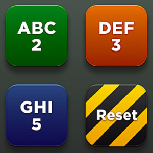
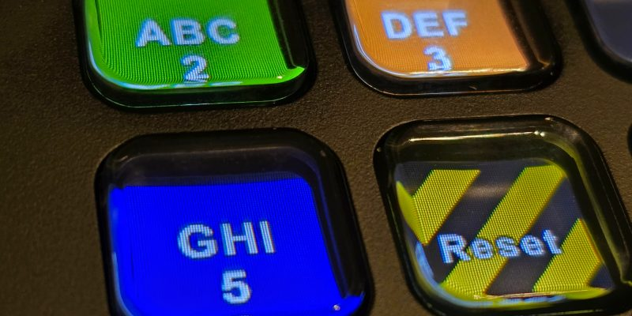
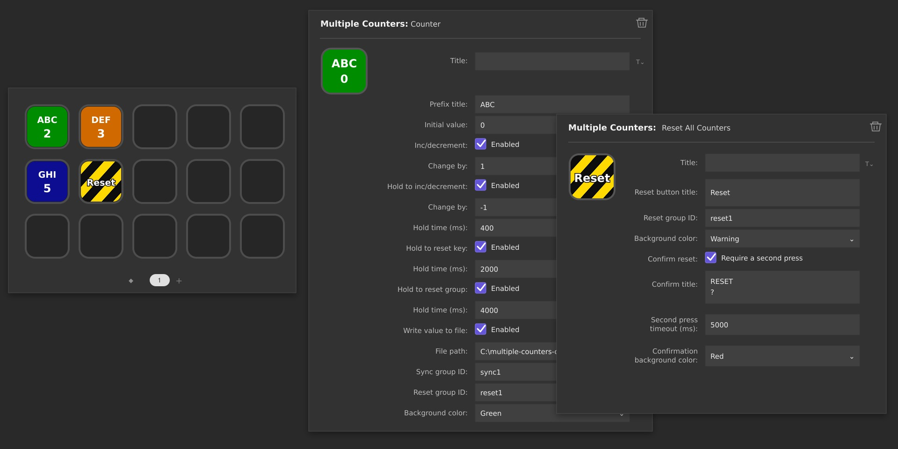

> [!CAUTION]
> I no longer have access to a Stream Deck device, which means I am unable to test changes myself. As a result, I cannot reliably provide further updates or fixes for this plugin.
> 
> Please use the latest version available [here](https://github.com/ElianKars/StreamDeck-Multiple-Counters/releases/tag/Latest) on Github. The Elgato Marketplace version is not up to date, as publishing there has additional requirements that I am currently unable to meet, including Stream Deck 6.4 or later compatibility, SDK Compatibility Version 2 or later, and DRM protection not being enabled.

# Multiple Counters for Stream Deck

A Stream Deck plugin that lets you group multiple counters and reset them all with a single press. Perfect for stream sessions, production tracking, quality control counts, or any situation where you need to monitor and reset multiple counts together.
 
 

## ✨Features

- Create multiple counter keys
- Increment/decrement counters individually or apply the same step across a sync group
- Optionally use a separate, configurable count change when a Counter key is held
- Optionally write each counter's current numeric value to a (text) file to use in other software
- Two ways to reset: either hold the counter key or use a dedicated Reset Action key
- Reset multiple counters at once as a group
- Optional confirmation before reset
- Customize background colors
- A Counter action can run inside a standard Multi Action, including sync-group updates
- Independently enable or disable normal, held, and reset actions per Counter key

## 🚀Installation
1. Find the _Multiple Counters_ plugin in the Stream Deck Store or download [here](https://github.com/ElianKars/StreamDeck-Multiple-Counters/releases/tag/Latest).
2. Double-click the downloaded file to install
3. Stream Deck will automatically add the plugin

## 🔧 Usage

### Counter Action
1. Drag the Counter Action to your Stream Deck
2. Configure settings:
   - **`Title`**: Leave this field blank; it is only read for styling (font, size, alignment), not for the counter label.
   - **`Prefix Title`:** Set your label shown before the value.
   - **`Initial value`:** Set an initial value for the counter. Defaults to `0` if empty.
   - **`Inc/decrement`:** Enable the normal short-press count action. `Change by` accepts a whole number like `1` or `-2` and defaults to `1` if empty.
   - **`Hold to inc/decrement`:** Enable a separate count change for a long press. `Change by` accepts any whole number and is independent of the normal `Change by`; `Hold time` must be a positive whole number of milliseconds.
   - **`Hold to reset key`:** Enable this to reset the pressed counter to its own initial value after the configured positive hold time.
   - **`Hold to reset group`:** Enable this to reset all counters with the same Reset group ID after the configured positive hold time.
   - **`Write value to file`:** Enable text-file output for this counter and enter a full file path. The file is created or overwritten with only the current numeric value when the counter initializes and whenever its value changes, including sync-group and reset-group updates. The parent directory must already exist and the Stream Deck process must have permission to write there. One-way: File output is plugin-to-file only. So changing the file never changes the counter.
   - **`Sync group ID`:** Set an ID to group counters so they all apply the same increment or decrement step when one of them is triggered. Example: `sync1`
   - **`Reset group ID`:** Set an ID to group counters for reset. Must match with 'Reset group ID' in a Reset Action. Example: `reset1`
   - **`Background Color`:** Choose a color.

> [!IMPORTANT]  
> Enter your label in `Prefix Title`. Use the built-in `Title` box only to style the text (font, size, alignment).

#### Counter press behavior

Normal and held count changes are mutually exclusive and are selected when the key is released. Setup is very flexible: The normal short-press action can be disabled independently; the held change may remain enabled and may be negative or positive. Resets always take priority. The key-reset and group-reset timers remain independent, so both resets can run during one sufficiently long press.

For example, with normal press `+1`, held change `-1` at 400 ms, key reset at 2000 ms, and group reset at 4000 ms:

| Release time | Result |
| ------------ | ------ |
| Before 400 ms | `+1` only |
| 400–1999 ms | `-1` only |
| 2000–3999 ms | Key reset only |
| 4000 ms or later | Key reset and group reset; no count change |

### Reset Action
1. Drag the Reset Action to your Stream Deck
2. Configure settings:
   - **`Title`**: Leave this field blank; it is only read for styling (font, size, alignment), not for the counter label.
   - **`Reset button title`:** Set the initial title for the Reset Action.
   - **`Reset group ID`:** Match with counters you want to reset. Each counter resets to its own `Initial value` (or 0 if no initial value is set). Example: `reset1`
   - **`Background Color`:** Choose normal state color.
   - **`Confirm Reset`:** Enable/disable double-press confirmation.
   - **`Confirm title`:** Set the title shown during the confirmation wait.
   - **`Second press timeout (ms)`:** Set confirmation timeout in milliseconds.
   - **`Confirmation background color`:** Choose color for confirmation state.

Each backgroundcolor also has an adjusted version '_(c)_' to provide better contrast with white text according to WCAG contrast requirements (minimum 4.5:1 ratio)

> [!IMPORTANT]  
> Enter your label in `Reset button title`. Use the built-in `Title` box only to style the text (font, size, alignment).

### Advanced setup and usage
You may want to press a single key on your Stream Deck to perform another action (such as launching a program) and increment a counter at the same time.

**How to set it up:**  
Use a standard Stream Deck **Multi Action** to combine both steps into one workflow.
For example, a **Multi Action** can:
1. launch a program
2. increment a counter

For step 2, add a **Counter** action inside the **Multi Action** and configure it like this:
- enable `Inc/decrement`
- `Change by` = `1`
- `Sync group ID` = `sync1`

Because this counter is placed inside the **Multi Action**, it will not be visible as a separate key on your Stream Deck.

To see the current count, add another **Counter** action, directly to a key, and use the same `Sync group ID` = `sync1`.  
Disable `Inc/decrement` if you want that visible counter to ignore normal short presses. Leave the other optional actions disabled if it should act purely as a read-only display.

Now, when you press the Multi Action key, your program is launched, the hidden counter is incremented, and the visible counter updates automatically.

## 🐛Support
Found a bug? [Open an issue](../../issues) 
Have a feature request? [Let me know](../../discussions/categories/ideas) 
I’d love to hear how you use it, even if you don’t have any questions.👂🏼 I’m very curious to know what kind of use case this plugin is useful for in your setup. [You’d really make my day by sharing it!❤️](../../discussions/4)
 

## 🛠️ Development
Built with:
- Stream Deck SDK
- Node.js v22.13.0 (LTS)
- TypeScript

## 📄License
[MIT License](LICENSE)

## 😼
> [!CAUTION]
> Beware: Cats are planning to take over the world! First, they steal our keyboards. Then your Stream Deck buttons. Finally, world domination.

## 📝Changelog
### 1.3.0
**New**
- **Hold to inc/decrement** 
  Adds an independently configurable positive or negative whole-number change and hold duration. Thanks [@Veri7ion](https://github.com/Veri7ion)
- **Per-counter text-file output** 
  Optionally writes the current numeric value to a configured file at initialization and after direct, synchronized, or reset changes. Thanks [@Veri7ion](https://github.com/Veri7ion)

**Changed**
- **Counter Property Inspector** 
  Optional behaviors now use checkboxes with conditional controls and validation warnings shown beside the relevant setting.
- **Independently enable or disable the different functions per Counter key
- **Display-only replaced** 
  The `Display-only` option has been removed. The normal `Inc/decrement` action now has its own checkbox that can be disabled.

**Upgrade note**
- Existing settings are migrated, as best as possible. Otherwise, re-add the action.

### 1.2.2
**New**
- **Long-press reset for Counter actions** 
Reset only the pressed counter via `Hold → reset key (ms)`.  
Reset all counters in the same reset group via `Hold → reset group (ms)`.
- **Initial value** 
Each counter can now start from its own configured initial value instead of always starting from `0`.
- **Decrement support** 
Counters can now count down as well as up by entering positive or negative whole numbers in `Inc/decrement by`.

**Changed**
- **`Increment by` renamed to `Inc/decrement by`** 
Better reflects support for both incrementing and decrementing.
- **`Second press timeout (ms)` now uses a text field instead of a slider** 
This works better in the Stream Deck UI.
- **UI text and placeholders improved** 
Several settings now have clearer labels and placeholder text.

**Upgrade note**
- Existing profiles may need to re-enter this value once after updating: 
`Second press timeout (ms)`

### 1.1.0
**New**
- **Counter synchronisation** 
Counters that share the same `Sync group ID` mirror each other. Incrementing any one of them immediately updates the others.
_Typical use-case:_ embed a hidden Counter in a Multi Action to bump a visible Counter key. See the _Usage_ section for details.

- **Display-only counters** 
Set 'Display-only' to prevent user input; pressing it won't do anything.
_Typical use-case:_ The Counter is incremented by a Multi Action, so this button should serve purely as a display and not accept direct input.

**Changed (possibly BREAKING)**
- **New field names**
The new functionality required some field renaming, plus two new fields.

| Old field                         | New field              | Applies to                         |
| --------------------------------- | ---------------------- | ---------------------------------- |
| `sharedId`                        | `Reset group ID`       | Increment Counter                  |
| `---`                             | `Sync group ID`        | Increment Counter / Reset Counters |
| `---`                             | `Display only`         | Increment Counter                  |
| `Target Shared ID`                | `Reset group ID`       | Reset Counters                     |
| `Initial title`                   | `Normal-state title`   | Reset Counters                     |
| `Wait for confirmation (seconds)` | `Second press timeout` | Reset Counters                     |

<ins>Upgrade note:</ins> Profiles created prior to this version may show empty values for the renamed fields; set them once to re-link.

### 1.0.1
- Minor textual adjustments
### 1.0.0
- Initial release
